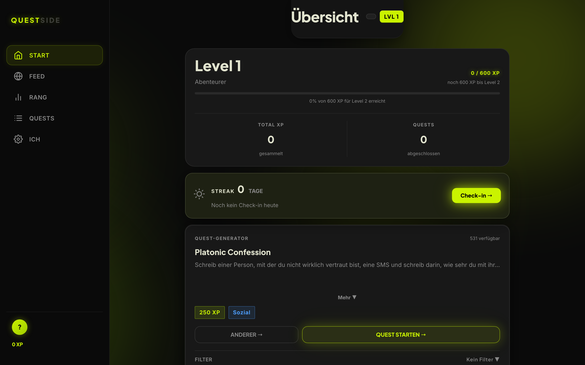

# 🎯 Questside

**Eine gamifizierte Quest-App, die aus 500+ Mini-Challenges echte Aufgaben fürs echte Leben macht — mit XP, Leveln, Streaks und Rangliste.**
_A gamified quest app that turns 500+ mini-challenges into real-life tasks — with XP, levels, streaks and a leaderboard._

> ℹ️ **Schaufenster / Showcase:** Live-App + Screenshot. Der Quellcode ist privat. / Live app + screenshot; source code is private.

### 🔗 [Live ausprobieren →](https://questside.app)
Sprache wählen, dann direkt loslegen. / Pick a language and start.

---

## 🇩🇪 Deutsch

### Was ist das?
Eine PWA, die Selbstverbesserung spielerisch macht: Statt einer To-do-Liste bekommst du **Quests** aus über 500 Mini-Challenges (Sozial, Mut, Fitness, Kreativität …). Jede erledigte Quest bringt XP, du steigst Level auf, hältst Streaks und misst dich in einer Rangliste.

### Warum habe ich das gebaut?
Klassische Produktivitäts-Apps motivieren nicht — Gamification schon. Ich wollte das Prinzip von Spielen (Fortschritt, Belohnung, Level) auf echte Handlungen im Alltag übertragen. Läuft als installierbare PWA auf jedem Gerät, mit Konto-Sync über die Geräte hinweg.

### Wie es aufgebaut ist
- **Frontend:** Single-File-PWA (Vanilla JS), installierbar, offline-fähig
- **Backend:** Supabase (Auth + Sync) und ein Cloudflare-Worker-KI-Backend
- **Gamification-Engine:** XP-/Level-System, Streaks, Rangliste, 500+ kuratierte Quests

## 🇬🇧 English

### What is it?
A PWA that gamifies self-improvement: instead of a to-do list you get **quests** from 500+ mini-challenges (social, courage, fitness, creativity …). Each completed quest earns XP, you level up, keep streaks and compete on a leaderboard.

### Why I built it
Classic productivity apps don't motivate — gamification does. I wanted to bring game mechanics (progress, reward, levels) to real-world actions. Runs as an installable PWA on any device with cross-device account sync.

### How it's built
- **Frontend:** single-file PWA (vanilla JS), installable, offline-capable
- **Backend:** Supabase (auth + sync) and a Cloudflare Worker AI backend
- **Gamification engine:** XP/level system, streaks, leaderboard, 500+ curated quests

---

## Tech
`Vanilla JS / PWA` · `Supabase` · `Cloudflare Workers` · `Gamification`
