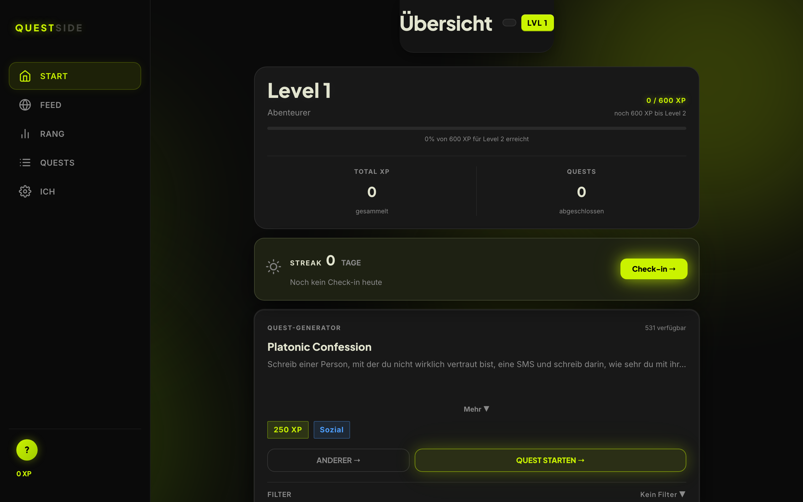

# 🎯 Questside

**Viele in meiner Generation verbringen enorm viel Zeit auf Instagram und TikTok — und erleben dabei wenig real mit Freunden. Questside gibt dir jede Woche echte Quests aus 500+ Mini-Challenges, mit XP, Leveln, Streaks und Rangliste. Ich nutze es selbst mit ein paar Freunden.**
_A lot of people my age spend huge amounts of time on Instagram and TikTok — and experience very little for real with friends. Questside gives you real quests every week from 500+ mini-challenges, with XP, levels, streaks and a leaderboard. I use it myself with a few friends._

> ℹ️ **Schaufenster / Showcase:** Live-App + Screenshot. Der Quellcode ist privat. / Live app + screenshot; source code is private.

### 🔗 [Live ausprobieren →](https://questside.app)
Sprache wählen, dann direkt loslegen. / Pick a language and start.

---

## 🇩🇪 Deutsch

### Das Problem
Viele in meiner Generation (mich eingeschlossen) verbringen enorm viel Zeit auf Instagram und TikTok — Zeit, die eigentlich für echtes Erleben mit Freunden draufgehen könnte. Bei mir kam dazu: Langeweile, ohne eine Idee, was ich stattdessen tun soll.

### Die Lösung
Eine PWA, die dir jede Woche echte **Quests** aus über 500 Mini-Challenges gibt (Sozial, Mut, Fitness, Kreativität …) — Aufgaben, bei denen du real etwas erlebst oder dich überwinden musst, statt weiterzuscrollen. Jede erledigte Quest bringt XP, du steigst Level auf, hältst Streaks — und kannst dich mit Freunden im Leaderboard messen, was zusätzlich motiviert, dranzubleiben. Ich nutze Questside selbst, zusammen mit ein paar Freunden. Installierbar auf jedem Gerät, mit Konto-Sync über die Geräte hinweg.

### Wie es aufgebaut ist
- **Frontend:** Single-File-PWA (Vanilla JS), installierbar, offline-fähig
- **Backend:** Supabase (Auth + Sync) und ein Cloudflare-Worker-KI-Backend
- **Gamification-Engine:** XP-/Level-System, Streaks, Rangliste, 500+ kuratierte Quests

## 🇬🇧 English

### The problem
A lot of people my age (myself included) spend huge amounts of time on Instagram and TikTok — time that could go into actually experiencing things with friends. On top of that, I had my own version of it: boredom, with no idea what to do instead.

### The solution
A PWA that gives you real **quests** every week from 500+ mini-challenges (social, courage, fitness, creativity …) — tasks where you actually go do something or push past your comfort zone, instead of scrolling further. Each completed quest earns XP, you level up, keep streaks — and can compete with friends on a leaderboard, which adds extra motivation to keep going. I use Questside myself, together with a few friends. Installable on any device with cross-device account sync.

### How it's built
- **Frontend:** single-file PWA (vanilla JS), installable, offline-capable
- **Backend:** Supabase (auth + sync) and a Cloudflare Worker AI backend
- **Gamification engine:** XP/level system, streaks, leaderboard, 500+ curated quests

---

## Tech
`Vanilla JS / PWA` · `Supabase` · `Cloudflare Workers` · `Gamification`
